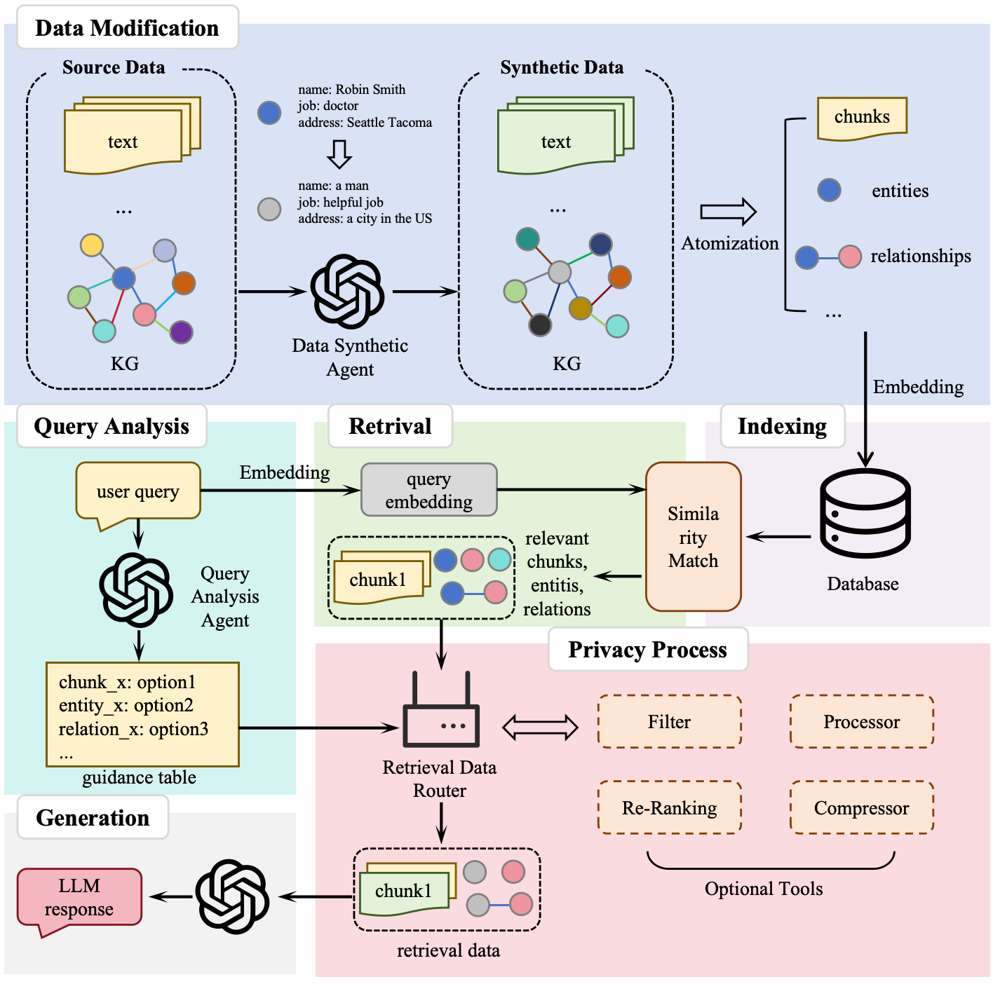

<center><h2>RAG隐私保护</h2></center>



## Install

* 从源码进行构建

```bash
cd RAG-Privacy
pip install -e .
```

## Quick Start
* 设置OPEN_API_KEY `export OPENAI_API_KEY="sk-...".`

以下是一个使用示例，详细可以见`privacy_protect.py`

### 配置需要使用的LMM和Embedding Model
```python
async def llm_model_func(
    prompt, system_prompt=None, history_messages=[], **kwargs
) -> str:
    return await openai_complete_if_cache(
        # gpt-4o
        "gpt-4o",
        api_key=os.environ.get("OPENAI_API_KEY"),
        base_url="https://api.openai.com/v1",

        prompt=prompt,
        system_prompt=system_prompt,
        history_messages=history_messages,
        **kwargs
    )

async def embedding_func(texts: list[str]) -> np.ndarray:
    return await openai_embedding(
        texts,
        api_key=os.environ.get("OPENAI_API_KEY"),
        base_url="https://api.openai.com/v1"
    )
```

### 插入数据
```python
rag.insert("text")
```

### 生成合成数据（可选择）
若需要使用合成数据，需要运行这一步骤
```python
rag.encrypt()
```

### 开始问答
```python
response = rag.query("如果我因为流感而发烧，请问该如何进行治疗？", param=QueryParam(mode="local", encrypt_mode=True, top_k=20, privacy_options=["filt", "synthetic", "compress", "rerank"]))
```

1. 第一个参数为需要询问的问题
2. 第二个参数为查询参数
  - encrypt_mode 参数代表是否开启隐私保护模式
  - privacy_options 参数代表可选择的隐私保护组件
  - top_k 参数代表一个查询所检索到的最大信息单元（实体或关系）数
  - mode 参数代表使用的查询等级